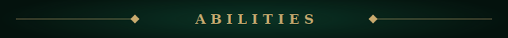
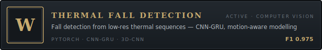
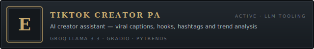
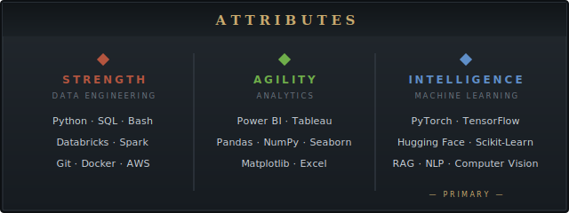
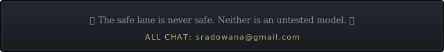

**Intelligence hero** · Ranged · Pierces spell immunity *(and messy datasets)*

AI & Data Science graduate, University of Hull — building multimodal AI + LLM tools — **open to entry-level data/ML roles & internships**

  

  

  

