  

**Intelligence hero** · Ranged · Pierces spell immunity *(and messy datasets)*

AI & Data Science graduate, University of Hull &nbsp;◈&nbsp; Building multimodal AI + LLM tools &nbsp;◈&nbsp; **Open to entry-level data/ML roles & internships** 🎯

 

## ⚔️ Abilities

| Key | Ability | Effect | Stack |
|:---:|---------|--------|-------|
| **Q** | 🔬 [Moodwave](https://github.com/sradowana-ux/moodwave) | Multimodal emotion recognition — RoBERTa + Wav2Vec2 late fusion, **F1 = 0.850** | PyTorch · Transformers · Gradio |
| **W** | 🌡️ [Thermal Fall Detection](https://github.com/sradowana-ux/thermal-fall-detection-pytorch) | CNN-GRU on thermal image sequences, **F1 = 0.975** | PyTorch · Computer Vision |
| **E** | 🎵 [TikTok Creator PA](https://github.com/sradowana-ux/tiktok-creator-pa) | LLM assistant for captions, hooks & trend analysis | Groq Llama 3.3 · Gradio |
| **R** | 🔭 [PaperScout](https://github.com/sradowana-ux/paper-scout) ⭐ *ultimate* | RAG research assistant — hybrid retrieval (BGE + BM25 + RRF), cited answers, eval harness | ChromaDB · FastEmbed · Groq |

## 📊 Attributes

| 🗡️ Strength — *Data Engineering* | 🏹 Agility — *Analytics* | 🔮 Intelligence — *ML / AI* ⭐ |
|:---|:---|:---|
| Python · SQL · Bash | Power BI · Tableau | PyTorch · TensorFlow |
| Databricks · Spark *(skilling up)* | Pandas · NumPy · Seaborn | Hugging Face · Scikit-Learn |
| Git · Docker · AWS | Matplotlib · Excel | RAG · NLP · Computer Vision |

## 📜 Quest Log

- [x] ⚡ Ship a production-grade RAG system → **PaperScout**
- [ ] 🛡️ Power BI dashboard — *mid lane, in progress*
- [ ] 🐉 Databricks lakehouse pipeline — *farming the offlane*

## 🏆 Match History

 

*「 The safe lane is never safe. Neither is an untested model. 」*

**gg — let's queue up:** [sradowana@gmail.com](mailto:sradowana@gmail.com)

